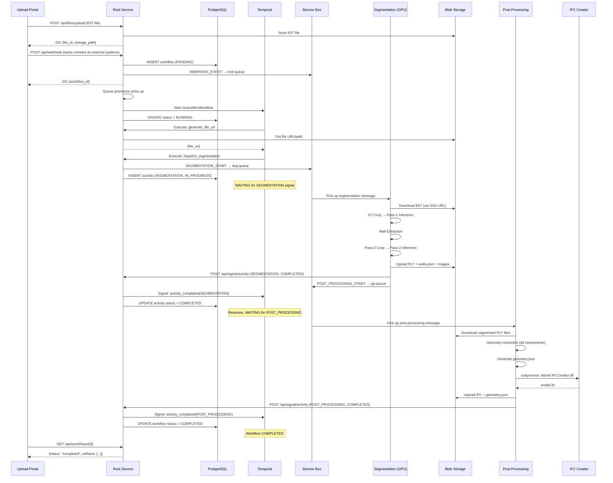

# 07 — Pipeline Flow (End-to-End Sequence)

Version: 1.0  
Status: Implementation Ready  
Prerequisite: 06_QUEUE_CONTRACTS.md

---

## 1. Complete Pipeline Sequence

```
TIME     STEP                                SERVICE              INFRASTRUCTURE
─────    ─────────────────────────────       ─────────────        ──────────────────
t=0      User uploads E57 via Portal         Upload Portal        HTTP → Root Service
         Portal calls POST /api/files/upload
         (stores file in blob)

t=1s     Root returns file_id + path         Root Service         → Blob Storage

t=2s     Portal triggers pipeline            Upload Portal        HTTP → Root Service
         POST /api/webhook (same contract
         any external system would call)

t=3s     Root Service validates input        Root Service         —
         ├── Check file format (e57)
         ├── Check required fields
         └── Generate workflow_id

t=4s     Create workflow record              Root Service         → PostgreSQL
         ├── INSERT workflow (PENDING)
         └── INSERT ingestion_request

t=5s     Put WEBHOOK_EVENT on root-queue     Root Service         → Service Bus
                                                                    (or memory queue)

t=5s     Queue processor picks up message    Root Service         ← Service Bus

t=6s     Start Temporal workflow             Root Service         → Temporal Server
         ├── Workflow: Scan2BimWorkflow
         └── Status: RUNNING

t=7s     Activity 1: generate_file_url      Root Service         → Blob / DataRepo
         ├── LOCAL: return local file path
         └── CLOUD: call DataRepo API → SAS URL

t=8s     Activity 2: dispatch_segmentation  Root Service         → Segmentation Queue
         ├── Build SEGMENTATION_START message
         ├── Send to esdt-s2b-segmentation-queue
         └── Workflow WAITS for signal

t=10s    KEDA detects queue message          KEDA                 → AKS (scale up)
         └── Scales GPU pod 0 → 1

t=60s    GPU pod starts (cold start)         AKS                  Container pull + boot

t=65s    Segmentation picks up message       Segmentation Svc     ← Segmentation Queue

t=70s    Download E57 from blob              Segmentation Svc     → Blob Storage
         └── ~30s for 2 GB file

t=100s   Image extraction (parallel)         Segmentation Svc     CPU (separate process)
         └── Extract 2D images from E57

t=105s   XY Crop (pass-1 preprocessing)     Segmentation Svc     CPU
         └── Histogram-based noise removal

t=110s   Pass-1 ML Inference (coarse)        Segmentation Svc     → NVIDIA GPU
         ├── Pointcept model
         ├── Block-stream method
         ├── Duration: 5–15 min
         └── Output: segmented PLY

t=900s   Wall Extraction                     Segmentation Svc     CPU
         ├── Detect wall planes from pass-1
         ├── Compute bbox2d
         ├── Detect rotation
         ├── Compute elevations
         └── Output: wall_geometry.json

t=920s   Pass-2 Crop (wall-bounded)          Segmentation Svc     CPU
         ├── IF is_rotated: rotate to axis-aligned
         ├── Crop by wall bbox2d
         └── Output: cropped PLY for pass-2

t=930s   Pass-2 ML Inference (refined)       Segmentation Svc     → NVIDIA GPU
         ├── Tighter bounds → higher precision
         ├── Duration: 3–10 min
         ├── IF was_rotated: inverse-rotate results
         └── Output: refined segmented PLY

t=1500s  Upload results to blob              Segmentation Svc     → Blob Storage
         ├── Upload pass-1 PLY
         ├── Upload pass-2 PLY
         ├── Upload wall_geometry.json
         └── Upload extracted images

t=1510s  Signal Root Service                 Segmentation Svc     → Root HTTP
         └── POST /api/signal/activity
             {activityName: "SEGMENTATION", status: "COMPLETED"}

t=1511s  Dispatch to Post-Processing         Segmentation Svc     → PP Queue
         └── Send POST_PROCESSING_AND_UPLOAD_START
             to esdt-s2b-post-processing-queue

t=1515s  Send status to Root Queue           Segmentation Svc     → Root Queue
         └── SEGMENTATION_COMPLETE message

t=1520s  GPU pod scales to zero              KEDA                 ← Queue empty

t=1512s  Temporal receives signal            Root Service         ← HTTP
         ├── Workflow resumes
         ├── Status: SEGMENTATION_COMPLETED
         └── Activity 3: track_post_processing

t=1530s  Post-Processing picks up message    Post-Processing Svc  ← PP Queue

t=1535s  Download segmented PLY files        Post-Processing Svc  → Blob Storage
         ├── Download pass-1 PLY
         ├── Download pass-2 PLY
         └── Download wall_geometry.json

t=1560s  Geometry Extraction Pipeline        Post-Processing Svc  CPU (heavy)
         ├── Wall detection (plane fitting)
         ├── Door detection (wall intersections)
         ├── Rack identification (OBB)
         ├── Cabinet detection
         ├── Battery Cabinet detection
         ├── Battery detection
         ├── Rectifier detection
         ├── Floor plane extraction
         ├── Ceiling plane extraction
         ├── Conflict resolution
         └── Duration: 10–30 min

t=3000s  Generate Geometry JSON              Post-Processing Svc  Disk
         └── Write complete geometry output

t=3010s  IFC Creation (subprocess)           IFC Creator (.NET)   CPU
         ├── Read geometry JSON
         ├── Convert to IFC4 using xBIM
         ├── Validate IFC structure
         └── Duration: 2–5 min

t=3300s  Upload IFC to delivery              Post-Processing Svc  → DataRepo / Blob
         ├── Get Cognito token (if cloud)
         ├── Get SAS upload URL from DataRepo
         ├── Upload IFC file
         └── Also: backup to blob storage

t=3340s  Signal Root Service                 Post-Processing Svc  → Root HTTP
         └── POST /api/signal/activity
             {activityName: "POST_PROCESSING", status: "COMPLETED"}

t=3341s  Temporal receives signal            Root Service         ← HTTP
         ├── Workflow completes
         ├── Status: COMPLETED
         └── Update PostgreSQL

t=3342s  Workflow complete                   Root Service         → PostgreSQL
         ├── UPDATE workflow status = COMPLETED
         ├── Record duration, artifacts
         └── IFC available for download

─────    TOTAL: ~55 minutes (typical)
```

---

## 2. Data Flow Diagram

```
┌──────────────────────────────────────────────────────────────────────────┐
│                            DATA FLOW                                      │
│                                                                          │
│  E57 File (1-5 GB)                                                       │
│      │                                                                   │
│      ▼                                                                   │
│  [Blob Storage] ─── SAS URL ──────────────────────┐                     │
│                                                    │                     │
│                                                    ▼                     │
│                                          [Segmentation GPU]              │
│                                                    │                     │
│                                                    ├── segmented_pass1.ply│
│                                                    ├── segmented_pass2.ply│
│                                                    ├── wall_geometry.json │
│                                                    └── images/           │
│                                                    │                     │
│                                                    ▼                     │
│                                          [Blob Storage]                  │
│                                                    │                     │
│                                                    ▼                     │
│                                          [Post-Processing]               │
│                                                    │                     │
│                                                    ├── geometry.json     │
│                                                    └── output.ifc        │
│                                                    │                     │
│                                                    ▼                     │
│                                          [Blob Storage] + [DataRepo]     │
│                                                    │                     │
│                                                    ▼                     │
│                                          [User downloads IFC]            │
└──────────────────────────────────────────────────────────────────────────┘
```

---

## 3. Blob Storage Path Convention

```
{container}/
├── {customer_id}/
│   └── {site_id}/
│       └── {file_id}/
│           ├── input/
│           │   └── scan.e57                    # Original upload
│           ├── segmentation/
│           │   ├── pass1/
│           │   │   └── output.ply              # Coarse segmentation
│           │   ├── pass2/
│           │   │   └── output.ply              # Refined segmentation
│           │   ├── walls/
│           │   │   └── wall_geometry.json      # Wall extraction output
│           │   └── images/
│           │       ├── image_001.png           # Extracted 2D images
│           │       └── ...
│           ├── geometry/
│           │   └── geometry.json               # Component geometry
│           └── output/
│               └── model.ifc                   # Final IFC file
```

---

## 4. Temporal Workflow Definition

```python
@workflow.defn
class Scan2BimWorkflow:
    """
    Durable workflow for InShelter scan processing.
    
    Steps:
    1. Generate file URL (sync)
    2. Dispatch segmentation (async + wait)
    3. Track post-processing (async + wait)
    
    Signals:
    - SEGMENTATION: from Segmentation Service
    - POST_PROCESSING: from Post-Processing Service
    """
    
    def __init__(self):
        self._signals: list[dict] = []
        self._status: str = "RUNNING"
    
    @workflow.signal
    async def activity_completed(self, data: dict):
        self._signals.append(data)
    
    @workflow.query
    def get_status(self) -> str:
        return self._status
    
    @workflow.run
    async def run(self, input: WorkflowInput) -> WorkflowResult:
        timeout = timedelta(minutes=input.signal_timeout_minutes)
        
        # STEP 1: Get file URL
        self._status = "GENERATING_URL"
        file_result = await workflow.execute_activity(
            "generate_file_url",
            args=[input.model_dump()],
            start_to_close_timeout=timedelta(minutes=5),
            retry_policy=RetryPolicy(maximum_attempts=3),
        )
        
        # STEP 2: Dispatch segmentation + WAIT
        self._status = "SEGMENTATION_DISPATCHED"
        await workflow.execute_activity(
            "dispatch_segmentation",
            args=[{**input.model_dump(), "file_url": file_result["file_url"]}],
            start_to_close_timeout=timedelta(minutes=5),
            retry_policy=RetryPolicy(maximum_attempts=3),
        )
        
        self._status = "WAITING_SEGMENTATION"
        seg_received = await workflow.wait_condition(
            lambda: any(
                s.get("activityName") == "SEGMENTATION" for s in self._signals
            ),
            timeout=timeout,
        )
        
        if not seg_received:
            self._status = "TIMED_OUT"
            raise ApplicationError("SEGMENTATION_TIMEOUT", non_retryable=True)
        
        seg_signal = next(
            s for s in self._signals if s["activityName"] == "SEGMENTATION"
        )
        if seg_signal["status"] == "FAILED":
            self._status = "FAILED"
            raise ApplicationError(
                f"SEGMENTATION_FAILED: {seg_signal.get('error', 'unknown')}",
                non_retryable=True,
            )
        
        # STEP 3: Track post-processing + WAIT
        self._status = "WAITING_POST_PROCESSING"
        await workflow.execute_activity(
            "track_post_processing",
            args=[input.model_dump()],
            start_to_close_timeout=timedelta(minutes=2),
        )
        
        pp_received = await workflow.wait_condition(
            lambda: any(
                s.get("activityName") == "POST_PROCESSING" for s in self._signals
            ),
            timeout=timeout,
        )
        
        if not pp_received:
            self._status = "TIMED_OUT"
            raise ApplicationError("POST_PROCESSING_TIMEOUT", non_retryable=True)
        
        pp_signal = next(
            s for s in self._signals if s["activityName"] == "POST_PROCESSING"
        )
        if pp_signal["status"] == "FAILED":
            self._status = "FAILED"
            raise ApplicationError(
                f"POST_PROCESSING_FAILED: {pp_signal.get('error', 'unknown')}",
                non_retryable=True,
            )
        
        self._status = "COMPLETED"
        return WorkflowResult(
            workflow_id=input.workflow_id,
            status="COMPLETED",
            output=pp_signal.get("output", {}),
        )
```

---

## 5. Error Handling Flow

### Retryable Errors

```
Service encounters retryable error (timeout, transient failure)
    │
    ▼
Service retries internally (3 attempts, exponential backoff)
    │
    ├── Success → Continue pipeline
    │
    └── All retries exhausted
         │
         ▼
    Message returns to queue (Service Bus redelivery)
         │
         ├── Redelivery succeeds → Continue
         │
         └── Max delivery count exceeded
              │
              ▼
         Message → Dead Letter Queue
              │
              ▼
         Alert triggered → Manual inspection required
```

### Non-Retryable Errors

```
Service encounters non-retryable error (corrupt file, OOM, model error)
    │
    ▼
Service signals FAILED to Root Service
    │
    ▼
Root Service receives signal
    ├── Updates PostgreSQL: workflow.status = FAILED
    ├── Temporal workflow throws ApplicationError
    └── Temporal records failure (durable)
    │
    ▼
Workflow terminal state — no automatic retry
    │
    ▼
Operator investigates → manual re-trigger if fixable
```

---

## 6. Compensation Flow (Cancel)

```
Operator sends cancel request
    │
    POST /api/signal/cancel {workflowId, reason}
    │
    ▼
Root Service
    ├── Temporal: cancel workflow
    ├── PostgreSQL: status = CANCELLED
    └── If segmentation in progress:
         └── Cannot cancel GPU job (runs to completion)
             BUT result will be ignored
```

---

## 7. Sequence Diagram (Mermaid)



---

## 8. Timing Breakdown (Typical)

| Phase | Duration | Percentage |
|-------|----------|-----------|
| Upload + Validation | 1–5s | <1% |
| Workflow Creation | 1–3s | <1% |
| GPU Cold Start (if scaled to zero) | 60–120s | 3–5% |
| E57 Download (2 GB) | 20–40s | 1–2% |
| Pass-1 Inference | 300–900s | 15–35% |
| Wall Extraction | 10–30s | <1% |
| Pass-2 Inference | 180–600s | 10–25% |
| Result Upload | 10–30s | <1% |
| Geometry Extraction | 600–1800s | 30–50% |
| IFC Creation | 120–300s | 5–10% |
| IFC Delivery | 5–30s | <1% |
| **TOTAL** | **20–90 min** | **100%** |

---

## 9. Parallel Processing Opportunities

| Step | Parallelizable With | Benefit |
|------|-------------------|---------|
| Image Extraction | Pass-1 Inference | Saves 30–60s |
| Pass-2 cropping prep | Wall JSON upload | Saves 5s |
| Geometry JSON upload | IFC Creation trigger | Saves 5s |
| IFC upload to DataRepo | IFC upload to Blob backup | Saves 10s |

**Maximum time savings from parallelism: ~1–2 minutes** (minor relative to total)
